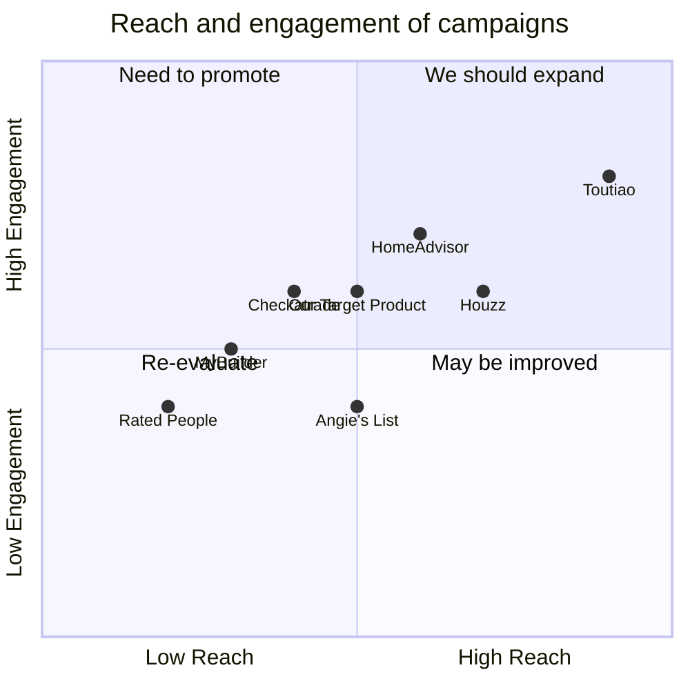

## Original Requirements
The boss has tasked us with designing a recommendation system similar to Toutiao, but for recommending UK building contractors.

## Product Goals
```python
[
    "Create a recommendation system that efficiently suggests UK building contractors to users",
    "Ensure the system is user-friendly and intuitive to navigate",
    "Incorporate a feedback mechanism to continuously improve recommendation accuracy"
]
```

## User Stories
```python
[
    "As a user, I want to receive personalized contractor recommendations so I can find the best fit for my project",
    "As a user, I want to be able to easily navigate the system so I can find information quickly",
    "As a user, I want to provide feedback on recommendations so the system can improve its suggestions",
    "As a user, I want to see contractor ratings and reviews so I can make an informed decision",
    "As a user, I want to save and compare different contractors so I can review my options later"
]
```

## Competitive Analysis
```python
[
    "Toutiao: A content recommendation platform that uses AI to personalize user feeds. However, it is not specialized in contractor recommendations",
    "Houzz: Offers a comprehensive directory of home improvement professionals, including contractors. Features include project photos, reviews, and the ability to contact professionals directly",
    "HomeAdvisor: Connects homeowners with prescreened service professionals for home improvement, maintenance and repair projects. Offers customer reviews and ratings",
    "Angie's List: Provides detailed reviews and ratings of contractors and healthcare providers. However, the platform is not as intuitive as others",
    "Checkatrade: UK-based platform where consumers can find reliable tradespeople. Features include customer reviews and a detailed profile for each tradesperson",
    "MyBuilder: Allows users to post jobs and receive quotes from interested tradespeople. Tradespeople are reviewed by users, but the platform lacks a sophisticated recommendation system",
    "Rated People: Connects homeowners with local tradespeople. Features include customer reviews and the ability to post jobs and receive quotes"
]
```

## Competitive Quadrant Chart


## Requirement Analysis
The product should be a recommendation system that suggests UK building contractors to users. It should be easy to navigate, allow users to provide feedback, and display contractor ratings and reviews. Users should also be able to save and compare different contractors.

## Requirement Pool
```python
[
    ("Implement a recommendation algorithm that suggests UK building contractors based on user preferences", "P0"),
    ("Design a user-friendly interface that is intuitive to navigate", "P0"),
    ("Incorporate a feedback mechanism that allows users to rate the accuracy of recommendations", "P0"),
    ("Display contractor ratings and reviews", "P0"),
    ("Allow users to save and compare different contractors", "P1")
]
```

## UI Design draft
The user interface should be clean and minimalist, with a focus on usability. The home page should display a feed of recommended contractors, with options to filter by location, specialty, and rating. Each contractor card should display the contractor's name, rating, and a brief description, with an option to view more details. There should also be a feature for users to save and compare contractors, as well as a mechanism for users to provide feedback on recommendations.

## Anything UNCLEAR
There are no unclear points.