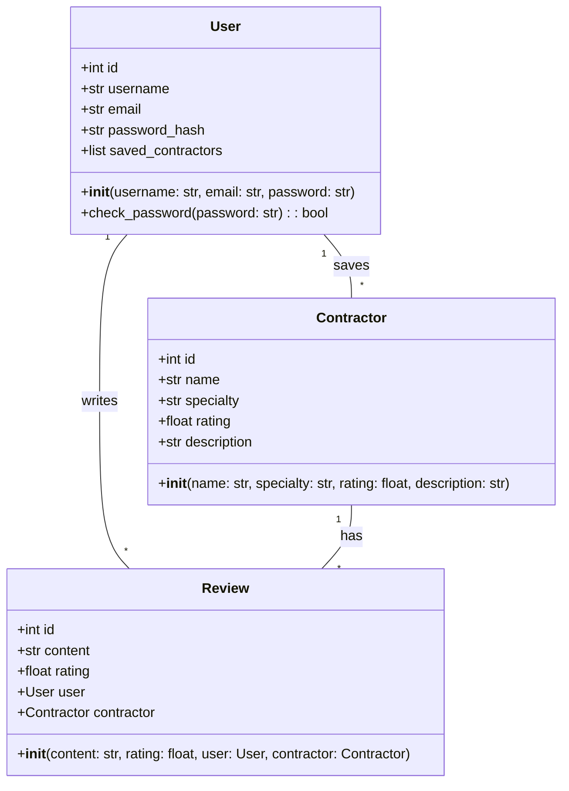
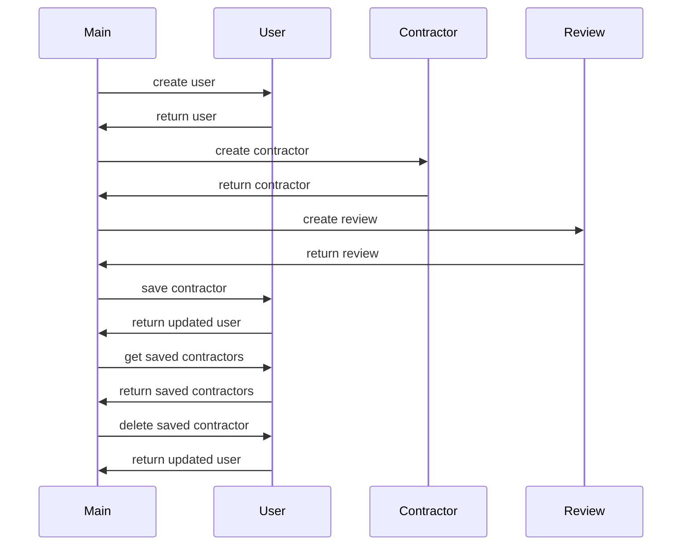

## Implementation approach
The system will be implemented using Python, with the Flask framework for the web interface. The recommendation algorithm will be based on collaborative filtering, using the Surprise library. The database will be handled using SQLAlchemy ORM for easier database operations. The feedback mechanism will be implemented using Flask-WTF for form handling. For testing, we will use the pytest framework.

## Python package name
```python
"contractor_recommender"
```

## File list
```python
[
    "main.py",
    "models.py",
    "forms.py",
    "views.py",
    "recommender.py",
    "tests.py"
]
```

## Data structures and interface definitions


## Program call flow


## Anything UNCLEAR
The requirement is clear to me.